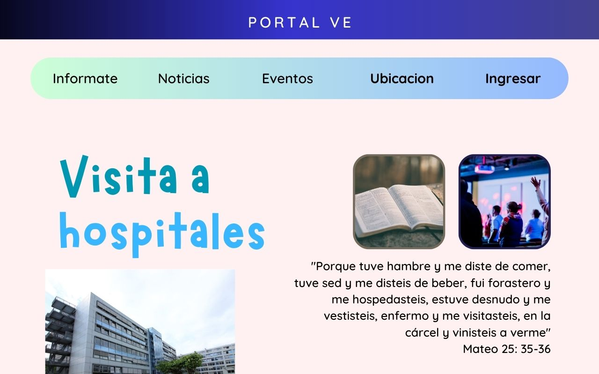

# Portal VE

Una aplicación web que nos permita automatizar y agilizar algunos procesos en la iglesia a la asisto.

## Sección publica

Aplicación web con el proposito de compartir: 
- Noticias
- Eventos
- Informes
- Ubicación de la iglesia

## Seccion privada

Uso de bases de datos para uso de administradores con los objetivos de:
- Llevar un control de miembros
    - Nombres
    - Si estudian o trabajan
    - Edad
    - Correo
    - Bautismos
    - Ministerio

- Ver pendientes
- Ver motivos de oración
- Gestionar responsables de los eventos

# Diagrama de flujo

